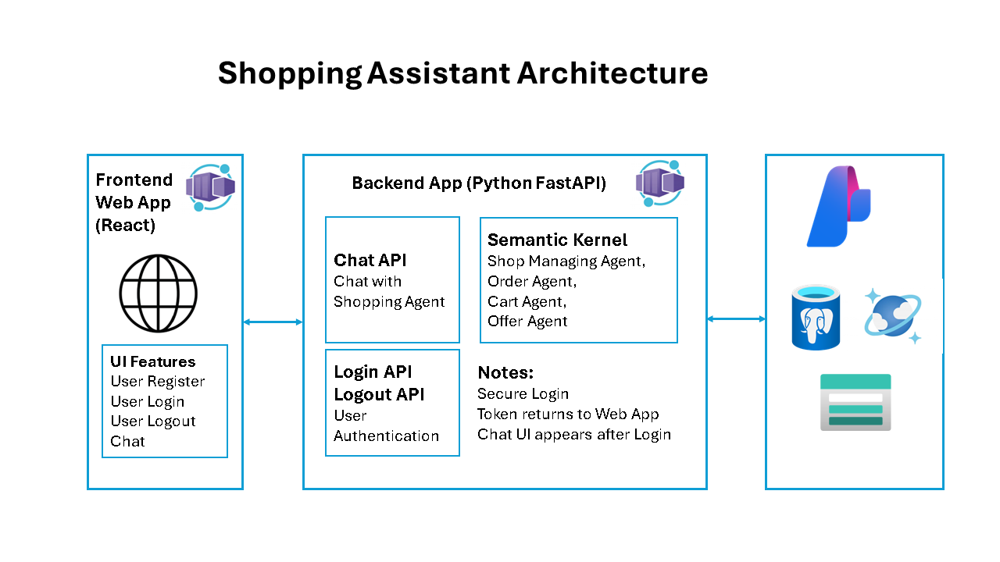

# Shopping Assistant - GitHub Copilot Agent Experiment

## Table of Contents
- [Shopping Assistant - GitHub Copilot Agent Experiment](#shopping-assistant---github-copilot-agent-experiment)
  - [Table of Contents](#table-of-contents)
  - [Project Approach](#project-approach)
  - [Tech Stack](#tech-stack)
  - [Solution Architecture](#solution-architecture)
  - [Current Status (Completed Work \& To-Do-List)](#current-status-completed-work--to-do-list)
      - [1. Completed Tasks with Results Documented:](#1-completed-tasks-with-results-documented)
      - [2. Pending Tasks (To-Do-List) - Call for Contributors!](#2-pending-tasks-to-do-list---call-for-contributors)
  - [Setup Guide](#setup-guide)
  - [How to Contribute](#how-to-contribute)
  - [References](#references)

## Project Approach

This is an experiment project to test the capabilities of GitHub Copilot Agent. This is to showcase how software development can be done quicker and with less effort with the help of GitHub Copilot. Refer to [Software Engineering in the Era of AI](./docs/extras/sw_in_ai_era.md) for a glimpse on what will happen in the next 5-10 years, starting today.

I'd like to see how much I can get out of the **GitHub Copilot Agent mode.** I'll document the prompt engineering process, **from an initial big idea, to capabilities, architecture design, to scaffolding code, and then to completed code modules and eventually, a working application.** This process will take some trial and error and prompt refinement. I hope to be surprised and satisfied in the end. If this process works, we could use it for our future projects.

Most of the initial prompts and results are posted to the **docs/prompts** folder. The code generation will be a detailed process. I will try to provide insights after all code has been generated and tested.

The generated code is in the **src** folder at the project root. The **frontend** subfolder contains the web interface built with **React**. The **backend** subfolder contains the AI application constructed with Python **FastAPI**, **Semantic Kernel**, **PostgreSQL DB**, and **Azure AI services**.

## Tech Stack

| Layer      | Technology         |
|------------|-------------------|
| Frontend   | React             |
| Backend    | FastAPI (Python)  |
| Database   | PostgreSQL        |
| Cloud      | Azure (App Service, PostgreSQL, AI Services) |
| DevOps     | Azure Developer CLI (azd) |

## Solution Architecture

The initial solution architecture is illustrated below. This is the key design to create various prompts for GitHub Copilot to generate code.



## Current Status (Completed Work & To-Do-List)

This is a side project beyond my full-time job. I will get back to do more on this project when I get some spare time.

#### 1. Completed Tasks with Results Documented:

- **Prompt Engineering (PE) 1**: [Capabilities](./docs/prompts/P1-Shopping-Assistant-Capabilities.md)
- **PE 2**: [Architecture Design](./docs/prompts/P2-Architecture-Design.md)
- **PE 2A**: [Architecture Design Discussions](./docs/prompts/P2A-Architecture-Design-Discussions.md)
- **PE Extra - Features**: [User Scenarios](./docs/prompts/User_Scenarios.md)
- **PE Extra - Security**: [Security Features](./docs/prompts/Security_Tokens.md)
- **PE 3**: [Project Folder Structure](./docs/prompts/P3-Project-Code-Structure.md)
- **PE 4**: [Scaffolding Code](./docs/prompts/P4-Scaffolding-Code.md)
- **PE Code Generation - Frontend**: [Frontend Web App Code Generated and Tested (stubbed backend)](./src/frontend)
- **Author's Task**: Create this main README.md with Initial Architecture Diagram. I still like this task. But I think this can be done by AI pretty soon.

#### 2. Pending Tasks (To-Do-List) - Call for Contributors!

Below are the list of things to be completed:

- **Database Setup:** Create Azure PostgreSQL DB, create tables.
- **Backend Code Generation**: Generate code for backend app.
- **Test Backend Functions**: Test backend functions via API calls.
- **Integrate Frontend and Backend**: Modify frontend app to call backend APIs. End-to-end testing. Check database results.
- **Test Integrated Solution**: New user registration. Signing in. Ask for offers. Ask agent to place an order. Make inquiry about orders placed. Ask return policy for ordered items.

## Setup Guide

1. **Clone the repository:**
   ```sh
   git clone <your-repo-url>
   cd ShopAssistant
   ```
2. **Set up the backend:**
   - See [src/backend/README.md](./src/backend/README.md) for Python/FastAPI setup. 
3. **Set up the frontend:**
   
   - See [src/frontend/README.md](./src/frontend/README.md) for React setup.
4. **Azure Developer CLI (azd):**
   - Follow [docs/extras/azd_setup.md](./docs/extras/azd_setup.md) for Azure deployment and environment management.

## How to Contribute

- Fork the repository and create your branch.
- Add your ideas, prompts to [docs/contribute](./docs/contribute) folder.
- Submit a pull request when your feature or fix is ready.

You are welcome to work with me on this project! You can find me at [Gail Zhou, PhD | LinkedIn](https://www.linkedin.com/in/gailzhou/).

## References

- [Software Engineering in the Era of AI](./docs/extras/sw_in_ai_era.md)
- [Project Prompts](./docs/prompts/)
- [User Scenarios](./docs/prompts/User_Scenarios.md)

