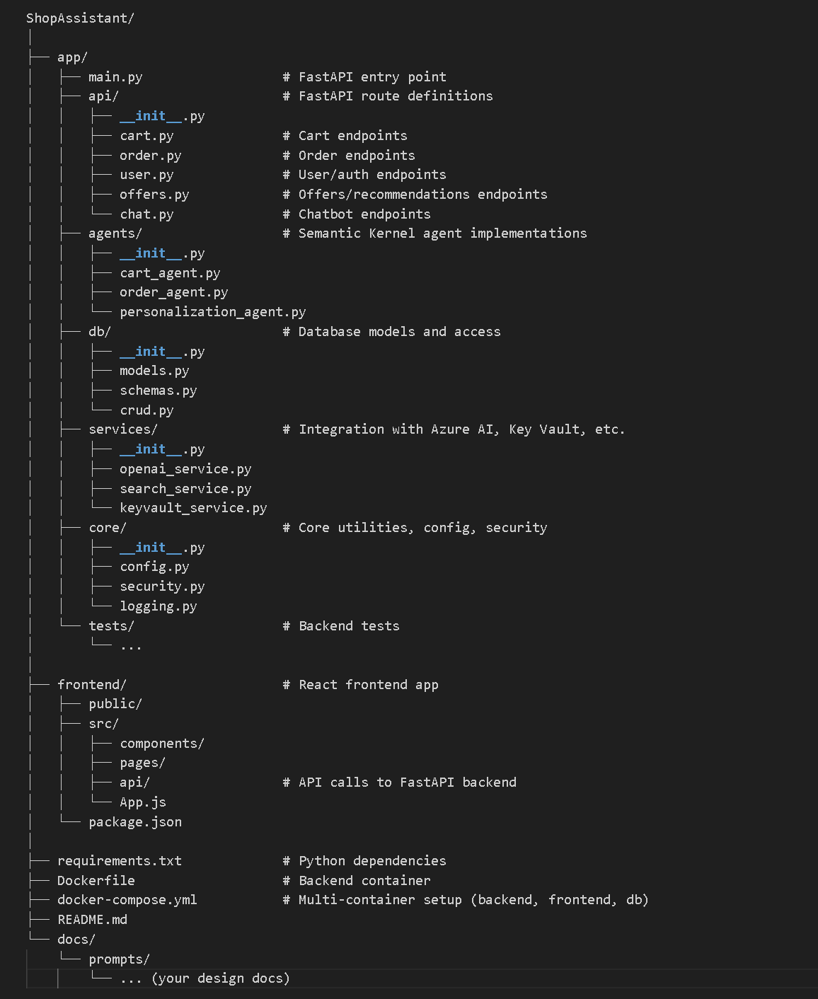

## GitHub Copilot Agent Mode - Prompt 3:   Generate Project Code Structure 

**Prompt**: Almost ready for generating code! I know this is your favorite part of the job, right? Can we design a file structure first based on the architecture document? Then we can start generating scaffolding code!

