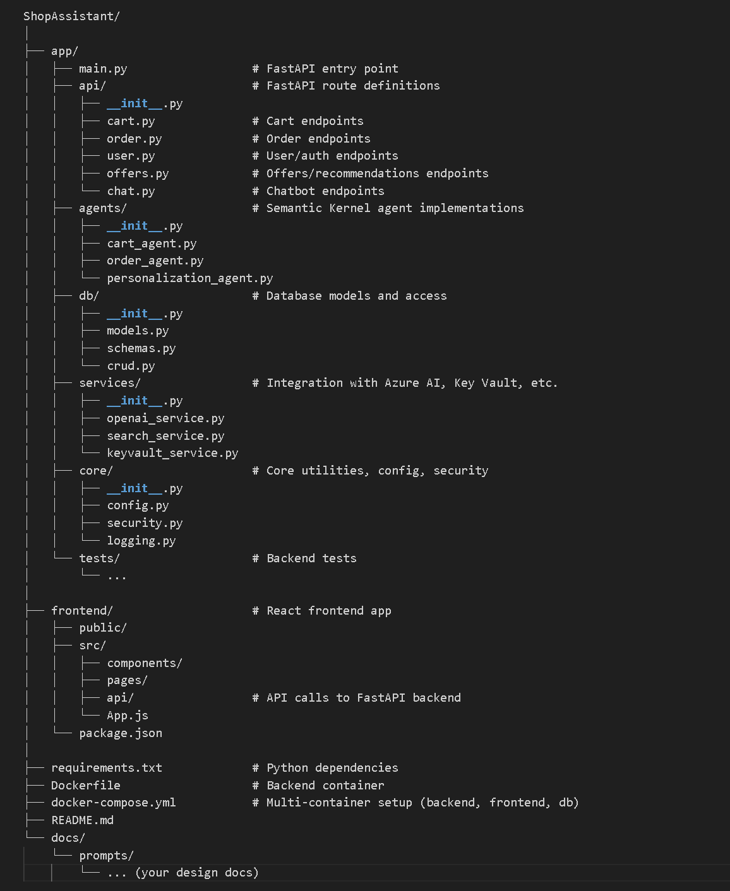

## GitHub Copilot Agent Mode - Prompt 3:   Generate Project Code Structure 

**Prompt**: Almost ready for generating code! I know this is your favorite part of the job, right? Can we design a file structure first based on the architecture document? Then we can start generating scaffolding code!

The initial folder structure can be found [project folder structure](./folder_structure.txt). Since then, the structure has changed as I have been working with Copilot on different ways to carry out the work. It is not important to update the structure as the code structure is up to date. You can review it in the **src** folder of the project root. 

Below is a screen capture of the initial project folder structure:  

